### Gmail receipts scrapper

Google app script for scrapping out various kind of receipts directly from your Gmail inbox. Currently supporting Swiggy & Ubereats receipts but can fairly be extended for any operator which delivers receipts to your Gmail account.  

#### Usage:
* Go to https://script.google.com/home
* Create a new project and copy [this](./Code.gs) script into the editor.
* Change the **searchMetaItems** as per your requirement. Apply the filters as you would write in Gmail search box to query for messages.
* Run function **main** by selecting from the dropdown (:information_source: You need to save and name your project before launch).
* Read the disclosure and provide appropriate authorizations.
* Go to **View > Executions**, check status and wait until it is **COMPLETED**. This step might take significant time depending on the volume of the messages that match your filter. For a typical 100 messages, it took around 250 seconds for me.
* Once completed, go to your Google Drive and look for a directory named **receipts** at the root of your drive. You should find all the extracted receipts with title and date received. Also there would be a spreadsheet summarizing all the messages and the total amount you have spent.

#### Demo:

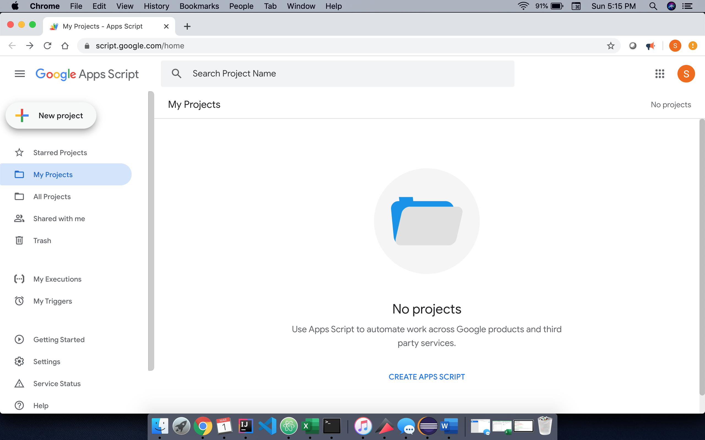
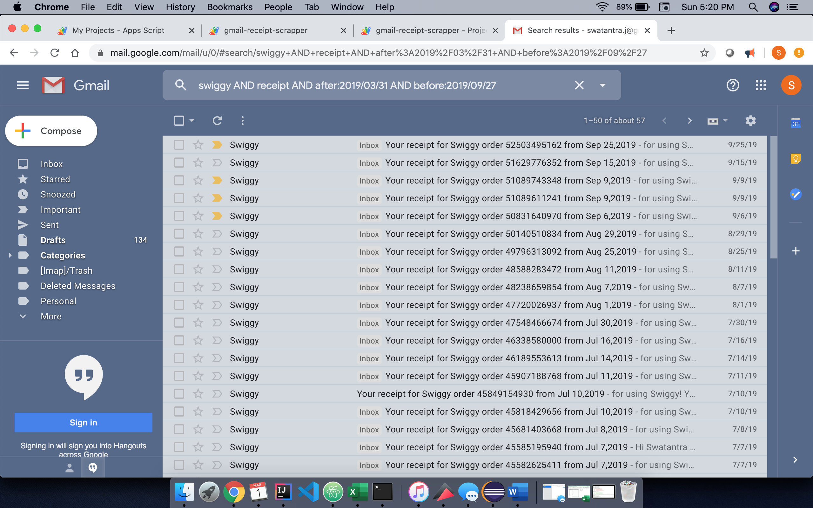
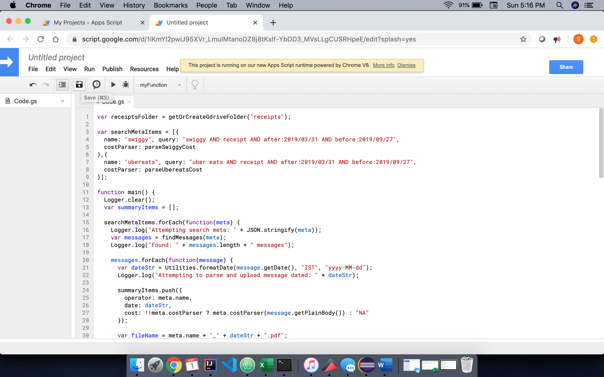
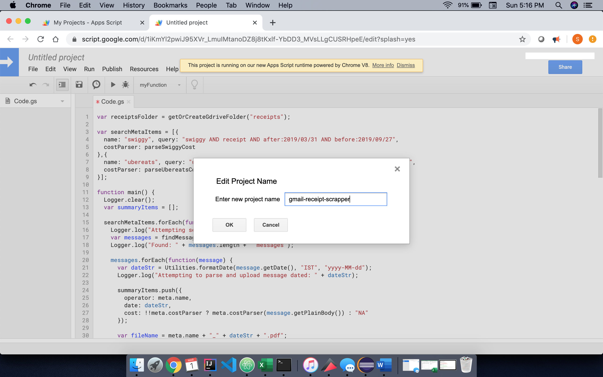
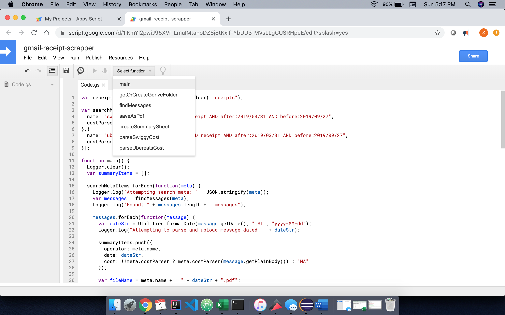
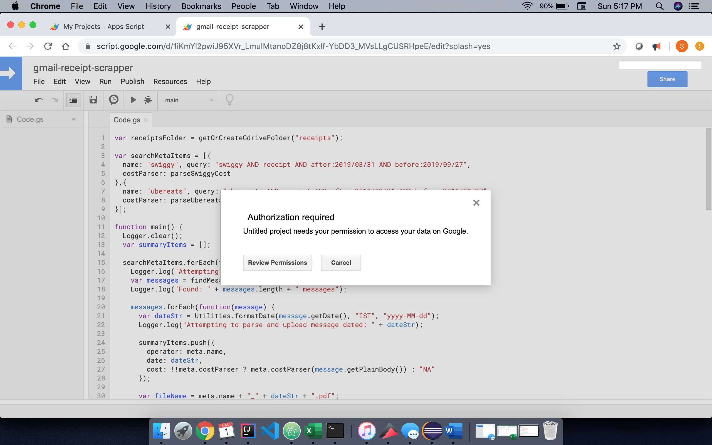
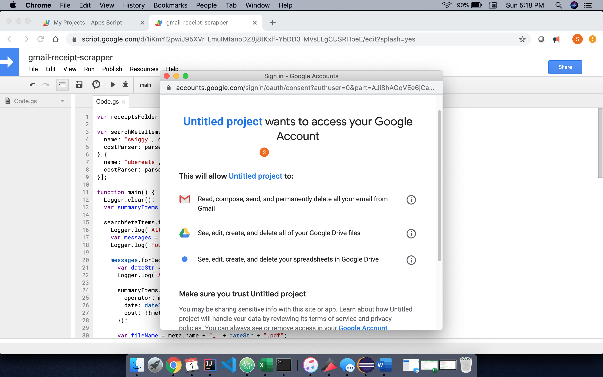
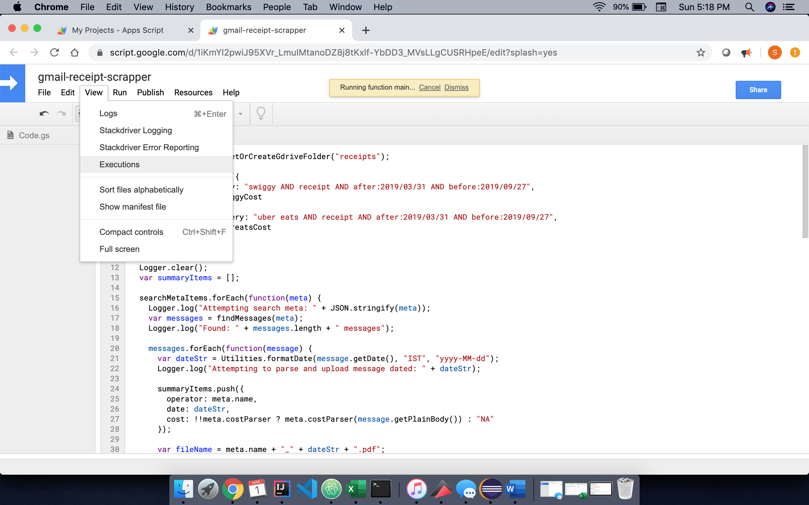
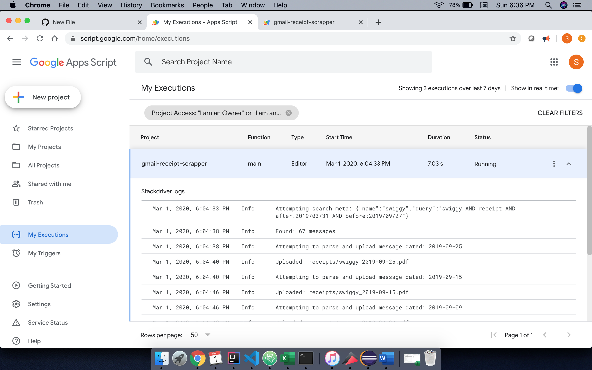
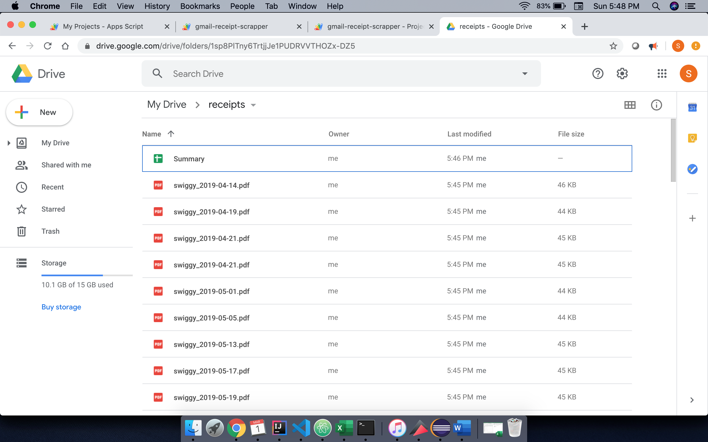
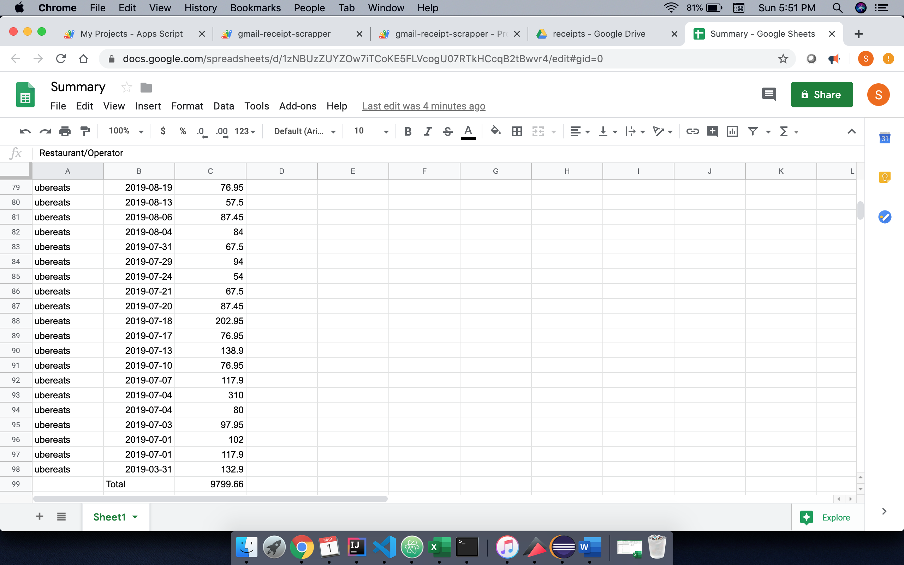

Hope it helps, cheers!
